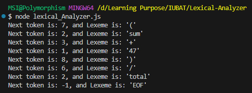

# Lexical-Analyzer
This project implements a Lexical Analyzer, which processes a given input string to tokenize it into meaningful symbols for further analysis, typically used in the context of programming language interpreters or compilers.

## Prerequisites and running the program
```bash
1. Add tsc to the program
2. command line >>> tsc
3. command line >>> node lexical_analyzer.js
```
## Input:
```bash
(sum + 47) / total
```
## Output:
The Lexical Analyzer parses the input string and generates tokens that represent the smallest individual components of the input. Each token is classified according to its type, such as identifier, operator, number, or parenthesis.



## Token Breakdown

* Token Breakdown:
* (: Left Parenthesis
* sum: Identifier
* +: Operator
* 47: Number
* ): Right Parenthesis
* /: Operator
* total: Identifier

## State Diagram Explain
To implement the Lexical Analyzer, a State Diagram was designed, which visually represents the finite-state machine (FSM) that drives the tokenization process.
```bash
Key Features of the State Diagram:
States:
Each state represents a phase in identifying a token, such as starting, reading an identifier, number, or operator.
Transitions:
The diagram shows how the system moves between states based on the input character.
Final States:
Certain states are marked as final states, indicating the successful recognition of a token.
The full State Diagram can be seen here:
```
## How It Works
Input Parsing:
The Lexical Analyzer scans the input string one character at a time.

## State Transitions:
Based on the character, the analyzer transitions through various states as defined in the state diagram.

## Token Generation:
When a final state is reached, the recognized token is stored and classified.

Output Generation:
The list of tokens is produced as output, which can be used for further processing like parsing or interpretation.‣敬楸慣⵬湡污穹牥漭ⵦ汰ੳ